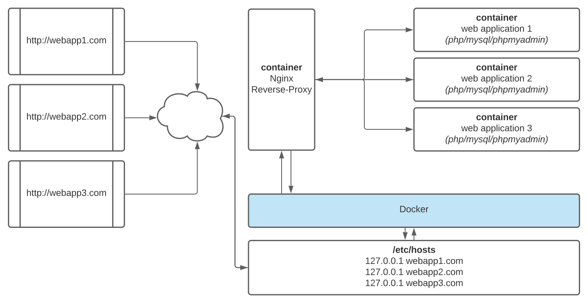

# Architecture Nginx-reverse-proxy for multi containers



### 1 Editez vos hosts

Ouvrez votre fichier `hosts`

````
sudo nano /etc/hosts
````

Ajoutez le site web du projet, exemple `local.example.com`

````
##
# Host Database
#
# localhost is used to configure the loopback interface
# when the system is booting.  Do not change this entry.
##
127.0.0.1       localhost
255.255.255.255 broadcasthost
::1             localhost
fe80::1%lo0     localhost

# My Docker projects
127.0.0.1  local.example.com
````
### 2 Configurez le `docker-compose` du projet web pour `Nginx`

Editer les variables d'environnement. Ajoutez également le lien du réseau Nginx.
`NGINX_HOST=local.example.com` est l'exemple de la documentation.

````
services:

  my_webapp:
    environment:
      # required
      - "NGINX_HOST=local.example.com"
      # optional
      - "NGINX_SET_HEADER=WWW-Authorization 'Basic 123456789',Authorization 'Basic 123456789'"
      - "NGINX_CONNECTION_TIMEOUT=5"
      - "NGINX_PORT=80"
      
      
networks:
  default:
    external:
      name: nginx-reverse-proxy_default
````

Env | require/optional | default | example
------------ | ------------- | ------------- | -------------
NGINX_HOST               | require  | `null` | `example.com`
NGINX_SET_HEADER         | optional | `null` | `WWW-Authorization 'Basic 123456789',Authorization 'Basic 123456789'`
NGINX_CONNECTION_TIMEOUT | optional  | `60` | `600`
NGINX_PORT | optional  | `80` | `8080`

### 3 Lancez votre docker

````
docker-compose up -d
````

Dans le fichier `default.conf` vous devriez avoir cela

````
# host local.exemple.com
upstream  my_webapp { server xxx.xx.xx.xx:80; }
server {
    listen 80;
    server_name local.exemple.com;
    location / {
        proxy_pass              http://my_webapp;
        proxy_redirect          off;
        proxy_set_header        Host $host;
        proxy_set_header        X-Real-IP $remote_addr;
        proxy_set_header        X-Forwarded-For $proxy_add_x_forwarded_for;
        proxy_set_header        X-Forwarded-Host $server_name;
        # custom
        proxy_set_header        WWW-Authorization "Basic 123456789";
        proxy_set_header        Authorization "Basic 123456789";
        # custom
        proxy_connect_timeout   5;
    }
}
````

# Hello world !

Rendez-vous dans votre navigateur préféré et ouvrez l'url `http://local.exemple.com`. !